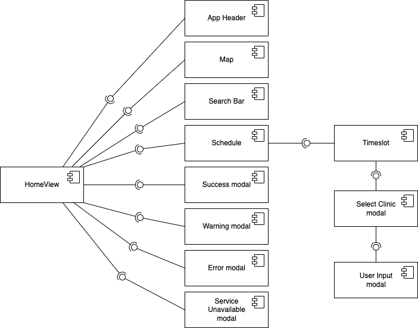

# T11 - Web Application Frontend

## Responsibilities

The **Frontend** communicates to the [Backend](../backend/README.md) and uses session ID for publishing and subscribing to messages, and renders elements according to incoming messages.

### Components responsibilities

<ins>App Header component</ins>
- Displays app logo
- Displays app name

<ins>Map component</ins>
- Displays map of Gothenburg
- Displays pins for dental clinics according to their coordinates
- Displays dental clinic name and opening hours upon clicking on pin

<ins>Search Bar component</ins>
- Displays date picker for user to be able to select the date for dental appointment
- Displays 'search' button that triggers the update of <ins>Schedule</ins> component

<ins>Schedule component</ins>
- Displays appointment slots for the week according to date that the user selected <br/>
<ins>Color coding for the slots according to availability:</ins><br/>
        - *grey* - 0 slots available<br/>
        - *yellow* - only 1 slot available<br/>
        - *green* - 2 or more slots available.

<ins>Timeslot component</ins>
- Displays amount of available slots for particular day and time interval
- Timeslots are clickable (for slots with availability of 1 or more) and trigger <ins>Select Clinic</ins> modal

<ins>Dynamic components</ins>
- <ins>*Select Clinic modal*:</ins> provides the user with available clinics options to be selected from
- <ins>*User Input modal*:</ins> prompts the user to provide name and email address to complete the booking
- <ins>*Success modal*:</ins> notifies the user that booking was successful (displays data provided during booking process) and that confirmation email has been sent
- <ins>*Warning modal*:</ins> notifies the user that the booking was successful (displays data provided during booking process) and an error occurred upon sending confirmation email
- <ins>*Error modal*:</ins> notifies the user that an error occurred during booking process and prompts to try using services again later
- <ins>*Service Unavailable modal*:</ins> notifies the user that service is currently unavailable and prevents the user from sending request to already overloaded system

Relationships of Frontend components can be found in the component diagram below.



## Development Tools
> Node.js <br> [Download here](https://nodejs.org/en/)

> Vue.js <br> [Installation guide here](https://vuejs.org/)

> Vite <br> [Installation guide here](https://vitejs.dev/)

> Bootstrap <br> [Installation guide here](https://getbootstrap.com/)

> BootstrapVue <br> [Installation guide here](https://bootstrap-vue.org/)

> GmapVue <br> [Installation guide here](https://diegoazh.github.io/gmap-vue/#v2-0-0)

> VueGeoLocation <br> [Installation guide here](https://console.cloud.google.com/welcome?project=clinics-368621&authuser=0&organizationId=1043303994003)

> Axios <br> [Installation guide here](https://axios-http.com/)

> MQTT.js <br> [Installation guide here](https://www.npmjs.com/package/mqtt)

## Getting started with Frontend

> ❗ Your broker must support websockets so that the browser can connect to it

> ❗ If you are using <ins>Mosquitto</ins>, be aware that it does <ins>not</ins> support websockets by default 

- To use websocket with the mosquitto.conf file, add the following:

```
listener 1883
protocol mqtt
listener 9001
protocol websockets
allow_anonymous true
```

- To run mosquitto with these configurations use: 

```
mosquitto -c mosquitto.conf -v
```

### After cloning the repo, open the terminal in your local machine, then:

|                   Description               |          Command         |
|---------------------------------------------|--------------------------|
| Change directory to the **frontend** folder | `cd frontend`            |
| Install dependencies                        | `npm install`            |
| Run **fronend**                             | `npm run dev`            |
| Visit generated link                        | `http://localhost:5173/` |